<div align="center">



<br/>

<a href="mailto:pawardurva273@gmail.com"></a>
<a href="https://www.linkedin.com/in/durva-pawar-04640b34a"></a>




</div>

## 👩‍💻 About Me

<table>
<tr>
<td width="50%" valign="top">

**🎓 Studying** &nbsp; B.Tech in AI & ML<br/>
**💻 Building** &nbsp; Full-stack web apps<br/>
**🧠 Exploring** &nbsp; ML pipelines & GenAI<br/>
**🤝 Leading** &nbsp; Tech community initiatives<br/>
**⚡ Open to** &nbsp; Collabs on AI/ML & web projects

</td>
<td width="50%" valign="top">

```python
class Durva:
    role  = "AI & ML Student"
    focus = ["Full-Stack", "ML", "GenAI"]

    def say_hi(self):
        print("Let's build something 🚀")

Durva().say_hi()
```

</td>
</tr>
</table>

<div align="center"></div>

## 🛠️ Tech Stack

<div align="center">

</div>

<div align="center"></div>

## 📊 GitHub Stats

<div align="center">


<br/>


</div>

<div align="center">


### ✍️ Random Dev Quote


<br/><br/>

**Thanks for stopping by! ⭐ Drop a star if something caught your eye.**

</div>

<!-- Proudly created with GPRM ( https://gprm.itsvg.in ) -->
